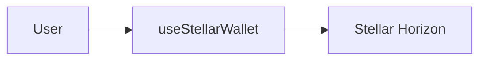

# Writing MDX with Custom Components

MDX lets you embed React components directly in Markdown. Nextellar docs registers a set of components globally, so you can use them in any `.mdx` file without an import statement.

## Available components

| Component                                              | Purpose                                    |
| ------------------------------------------------------ | ------------------------------------------ |
| `Note`                                                 | Callout box for tips, warnings, and info   |
| `Tabs`, `TabsList`, `Tab`, `TabsContent`               | Tabbed content panels                      |
| `Steps`, `Step`, `StepTitle`, `StepContent`            | Numbered step sequences                    |
| `FolderTree`, `Folder`, `File`                         | Visual directory trees                     |
| `Button`                                               | Styled action button                       |
| `Mermaid`                                              | Render Mermaid diagrams                    |
| `CodeTabs`                                             | Syntax-highlighted code with language tabs |
| `Dialog`, `DialogTrigger`, `DialogContent`             | Modal dialog                               |
| `Popover`, `PopoverTrigger`, `PopoverContent`          | Floating popover                           |
| `Select`, `SelectContent`, `SelectItem`, `SelectValue` | Dropdown select                            |
| `Checkbox`, `Label`, `Input`                           | Form controls                              |
| `Menu`, `MenuItem`, `MenuTrigger`, `PopMenu`           | Dropdown menu                              |

## Note

Use `Note` to highlight important information.

```mdx
<Note>Run `pnpm build:content` after adding any new MDX file.</Note>
```

**Renders as:**

<Note>Run `pnpm build:content` after adding any new MDX file.</Note>

## Tabs

Use `Tabs` to show alternative content side by side.

````mdx
<Tabs defaultValue="npm">
  <TabsList>
    <Tab value="npm">npm</Tab>
    <Tab value="pnpm">pnpm</Tab>
  </TabsList>
  <TabsContent value="npm">```bash npm install ```</TabsContent>
  <TabsContent value="pnpm">```bash pnpm install ```</TabsContent>
</Tabs>
````

## Steps

Use `Steps` for sequential instructions.

```mdx
<Steps>
  <Step>
    <StepTitle>Install dependencies</StepTitle>
    <StepContent>Run `pnpm install` in the project root.</StepContent>
  </Step>
  <Step>
    <StepTitle>Start the dev server</StepTitle>
    <StepContent>Run `pnpm dev` and open http://localhost:3000.</StepContent>
  </Step>
</Steps>
```

## FolderTree

Use `FolderTree` to illustrate project or file structures.

```mdx
<FolderTree>
  <Folder element="src" defaultOpen={true}>
    <Folder element="hooks">
      <File>
        <p>useStellarWallet.ts</p>
      </File>
    </Folder>
    <Folder element="components">
      <File>
        <p>WalletConnectButton.tsx</p>
      </File>
    </Folder>
  </Folder>
</FolderTree>
```

**Renders as:**

<FolderTree>
  <Folder element="src" defaultOpen={true}>
    <Folder element="hooks">
      <File>
        <p>useStellarWallet.ts</p>
      </File>
    </Folder>
    <Folder element="components">
      <File>
        <p>WalletConnectButton.tsx</p>
      </File>
    </Folder>
  </Folder>
</FolderTree>

## Mermaid

Use `Mermaid` (or a fenced `mermaid` code block) to render diagrams.

````mdx

````

## CodeTabs

Use `CodeTabs` to show the same snippet in multiple languages.

```mdx
<CodeTabs
  tabs={{
    tsx: { syntax: 'const { address } = useStellarWallet();', language: 'tsx' },
    js: { syntax: 'const { address } = useStellarWallet();', language: 'js' },
  }}
/>
```

## Notes on usage

- All components listed above are globally available — no import needed.
- Component names are case-sensitive: use `Note`, not `note`.
- Standard HTML attributes like `className` work on all components.
- For components not listed here, check `src/components/mdx-components.tsx` for the full registry.
